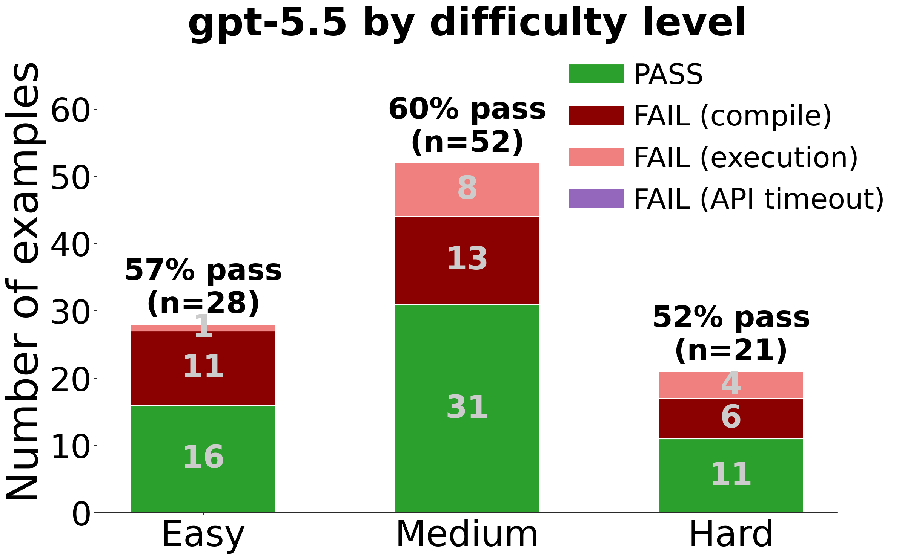
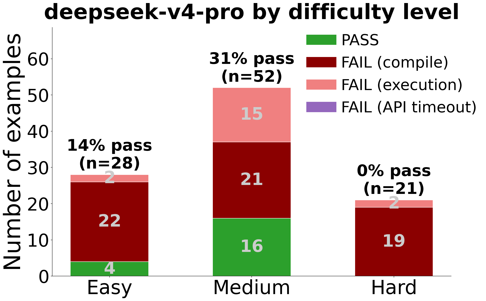
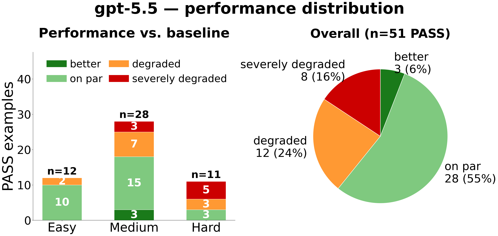
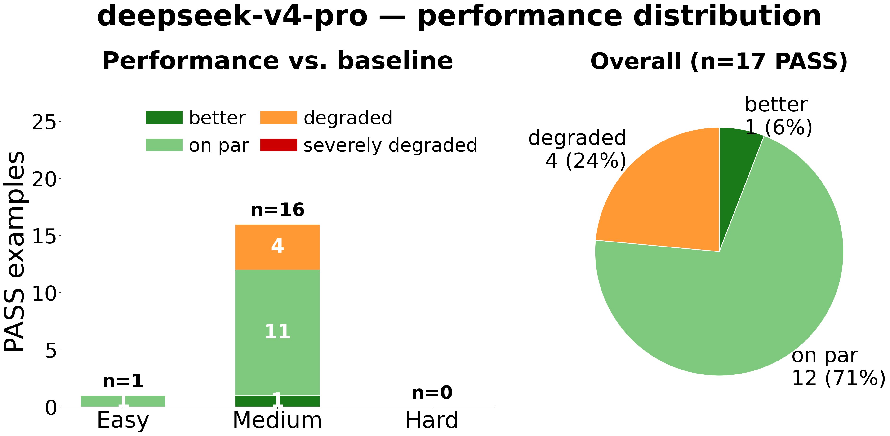
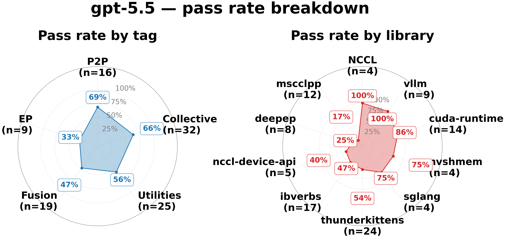
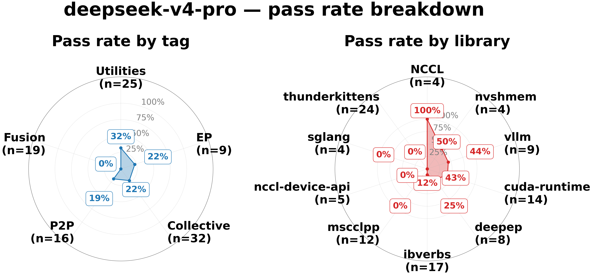

<div align="center" >
  <p align="center">
    <br/>
    <em>CommBench: can LLMs write correct and efficient GPU communication code?</em><br/><br/>
  </p>

  <p align="center">
        <a href="https://uccl-project.github.io/posts/commbench/"><b>Blog</b></a> |
        <a href="https://join.slack.com/t/uccl-dev/shared_invite/zt-3xbjdb0d0-tvDeUhGxtYxvGqsGKQ31Uw"><b>Join Slack</b></a> |
        <a href="https://x.com/uccl_proj"><b>Twitter/X</b></a> |
        <a href="#leaderboard"><b>Leaderboard</b></a> |
        <a href="#quick-start"><b>Quick Start</b></a> |
        <a href="datasets/readme.md"><b>Contributing</b></a>
  </p>
</div>

## Highlights

- **A benchmark for multi-device GPU communication code.** 100+ independently runnable examples spanning **P2P**, **collective**, **expert-parallel (EP)**, **compute–communication fusion**, and **utilities**, each labeled Easy / Medium / Hard.
- **Curated by GPU communication experts.** Every example is hand-written by GPU communication experts or expert-extracted from production codebases including [Mscclpp](https://github.com/microsoft/mscclpp), [NCCL](https://github.com/NVIDIA/nccl), [NVSHMEM](https://developer.nvidia.com/nvshmem), [DeepEP](https://github.com/deepseek-ai/DeepEP), [ThunderKittens](https://github.com/HazyResearch/ThunderKittens), [vLLM](https://github.com/vllm-project/vllm), and [SGLang](https://github.com/sgl-project/sglang).
- **Cheat-resistant evaluation harness.** Randomized test inputs, edit-region verification, and hidden build scripts prevent hard-coding and library substitution.
- **Correctness *and* performance.** Generated code is compiled, run, and compared against a hand-written reference on both correctness and speed, with optional multi-round refinement from compile/run feedback.

_Today's frontier LLMs write excellent single-device code yet consistently fail on multi-device GPU communication, precisely the code that bottlenecks large-scale LLM training and inference. CommBench measures, and aims to help close, that gap._

## How It Works

```
 empty_*.cu/cpp          LLM (GPT, Gemini, Claude, Grok, GLM, Qwen …)          generated_*.cu/cpp
 ┌──────────────┐              ┌──────────┐                   ┌──────────────────┐
 │  // TODO     │ ── prompt ──▶│  Model   │── code response──▶│  filled-in code  │
 │  // TODO     │              └──────────┘                   └──────────────────┘
 └──────────────┘                                                       │
                                                                        ▼
                                                              build & run & compare
                                                                        │
                                                                        ▼
                                                            summary.json + plots
```

1. **Prompt** — reads the `empty_*` template (reference code with core logic stripped to `// TODO`), builds a completion prompt.
2. **Generate** — sends the prompt to an LLM. With `--max-rounds > 1`, compile/run errors are fed back for self-correction.
3. **Evaluate** — compiles and runs both reference and generated code, compares correctness and performance (latency, throughput), and produces CSV, plots, and a `summary.json`. Supported models: OpenAI GPT, Google Gemini, Anthropic Claude, Grok, DeepSeek, GLM, and Qwen.

## Benchmark Categories

| Category | What it covers |
|---|---|
| **P2P** | Point-to-point transfer between a pair of devices |
| **Collective** | Group operations across all ranks (AllReduce, AllGather, All-to-All, …) |
| **EP** | Dynamic, non-uniform dispatch/combine traffic for MoE models |
| **Fusion** | Kernels that interleave communication with compute (e.g., AllGather+GEMM) |
| **Utilities** | Connection setup, buffer registration, topology queries, GPU–CPU FIFO queues |

**By source**, examples span cuda-runtime, ibverbs, Mscclpp, NCCL, NVSHMEM, DeepEP, the NCCL device API, ThunderKittens, vLLM, and SGLang.

## Leaderboard

> Sorted by **Pass×GM** ⭐ — pass rate scaled by geometric-mean code quality on passing examples. See the [blog post](https://uccl-project.github.io/posts/commbench/) for full metric definitions and case studies.

| Rank | Model | Pass×GM | Pass Rate | PASS+Good | GM‑Speedup | Open Source | Price |
|:----:|:------|:-------:|:---------:|:---------:|:----------:|:-----------:|:-----:|
| 🥇 | **gpt-5.5** | **0.467** | 57.4% | 30.7% | 0.813 | ❌ | $1.91 |
| 🥈 | **gemini-3.1-pro-preview** | 0.305 | 36.6% | 25.7% | 0.832 | ❌ | $0.26 |
| 🥉 | **claude-opus-4-7** | 0.282 | 33.7% | 20.8% | 0.836 | ❌ | $0.21 |
| 4️⃣ | **glm-5.1** | 0.281 | 29.7% | 17.8% | 0.947 | ✅ | $0.63 |
| 5️⃣ | **kimi-k2.6** | 0.275 | 30.7% | 18.8% | 0.895 | ✅ | $0.10 |
| 6️⃣ | **qwen3.7-max** | 0.269 | 26.7% | 15.8% | 1.008 | ❌ | $0.03 |
| 7️⃣ | **deepseek-v4-pro** | 0.197 | 19.8% | 12.9% | 0.995 | ✅ | $0.02 |

### Metrics

| Metric | Formula | What it measures |
|:-------|:--------|:----------------|
| **Pass×GM** ⭐ | Pass Rate × GM‑Speedup | Pass rate scaled by geometric-mean code quality on passing examples. Primary ranking metric. |
| **Pass Rate** | PASS / Total | Fraction of examples where code compiled, ran, and produced correct results. |
| **PASS+Good** | (on\_compare + better) / Total | Fraction of all examples with correct **and** performant code (within −5% of reference). |
| **GM‑Speedup** | GM of per-example speedup scores | Geometric mean of generated-vs-reference performance ratios over passing examples, taken across measured data sizes so each data point contributes equally. Computed only over *passing* examples, so a model that passes more (often harder) examples with mediocre performance can score lower; we therefore rank by Pass×GM. |
| **Price** | — | Average cost per example (USD). |

### Top vs. Bottom Model

A detailed comparison of the highest- and lowest-scoring models, gpt-5.5 (Pass×GM = 0.467) and deepseek-v4-pro (Pass×GM = 0.197).

#### Difficulty Breakdown

<table>
<tr>
<td align="center" width="50%"><b>GPT-5.5</b></td>
<td align="center" width="50%"><b>DeepSeek-V4-Pro</b></td>
</tr>
<tr>
<td></td>
<td></td>
</tr>
</table>

#### Performance Quality Among PASS Examples

<table>
<tr>
<td align="center" width="50%"><b>GPT-5.5</b></td>
<td align="center" width="50%"><b>DeepSeek-V4-Pro</b></td>
</tr>
<tr>
<td></td>
<td></td>
</tr>
</table>

#### Tag and Library Coverage

<table>
<tr>
<td align="center" width="50%"><b>GPT-5.5</b></td>
<td align="center" width="50%"><b>DeepSeek-V4-Pro</b></td>
</tr>
<tr>
<td></td>
<td></td>
</tr>
</table>

Key findings:

- **Even the strongest model passes under 60% of examples** and produces performant code on only a third.
- **Every model collapses to near-zero coverage on specialized libraries** such as Mscclpp, ThunderKittens, and the NCCL device API. Models hallucinate APIs, misplace synchronization, and ship kernels orders of magnitude slower than reference.
- **Multi-round self-correction helps only on commodity libraries and easier tasks.** Giving deepseek-v4-pro 5 rounds raises its pass rate from 15.8% to 41.6%, but unlocks neither Hard examples nor specialized libraries.

## Quick Start

```bash
# 1. Install dependencies
pip install -r requirements.txt

# 2. Set at least one API key
export OPENAI_API_KEY="..."          # → --model gpt-4o
export GOOGLE_API_KEY="..."          # → --model gemini-3-pro-preview
export ANTHROPIC_API_KEY="..."       # → --model claude-sonnet-4-5-20250929

# 3. Verify GPU compiler
nvcc --version    # NVIDIA
hipcc --version   # AMD

# 4. Run an evaluation
python scripts/generate_eval_one.py example001_gpu_comm_single_process \
    --model gpt-4o \
    --max-rounds 3
```

This reads the `empty_*` template, sends it to the model, compiles and runs the generated code, compares it against the reference, and writes a `summary.json` with correctness and performance results.

### Options

```bash
python scripts/generate_eval_one.py <example_name> [options]

Options:
  --model MODEL          LLM to use (default: gpt-4o)
  --max-rounds N         Max generation rounds with error feedback (default: 1)
  --temperature FLOAT    Sampling temperature (default: 0.3)
  --datasets-dir PATH    Base datasets directory (default: ./datasets)
  --no-save              Don't save generated code
  --quiet                Suppress detailed output
```

A single example's `build_and_run.py` can also be run directly:

```bash
python build_and_run.py --source ref_gpu_p2p_comm.cpp                              # build & run reference
python build_and_run.py --compare ref_gpu_p2p_comm.cpp generated_gpu_p2p_comm.cpp  # compare ref vs generated
```

## Contributing

To contribute a new example, please follow the requirements in the [Dataset Instructions](datasets/readme.md).

## Acknowledgements

We thank Mibura and AMD for sponsoring the testbed for this benchmark.

## License

MIT License
